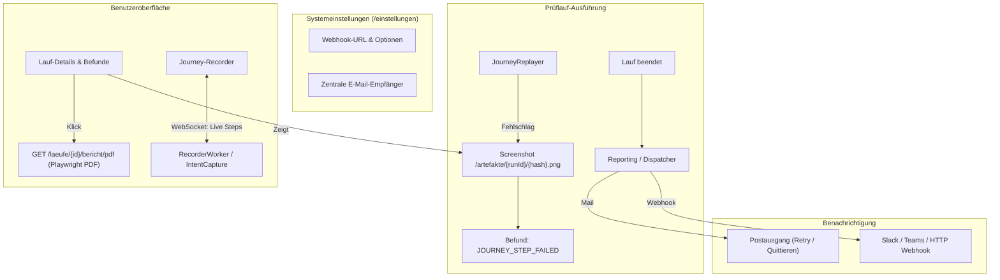

# WebTestHelper UX Enhancements & Feature Expansion — Design Specification

**Date:** 2026-09-03  
**Status:** In Review  
**Author:** Antigravity & Hendrik  

---

## 1. Context & Motivation

WebTestHelper is designed to empower non-technical and occasional users (marketing managers, content managers, site owners) to monitor websites autonomously. An evaluation from this target persona highlighted key friction points:
1. **Technical Jargon in Journeys & Scopes:** Raw Playwright/Selenium terms (`GOTO`, `CLICK`, CSS selectors, regex, drift, timeout in ms) and bureaucratic terms (*Ausgangsbestand*) confuse occasional users.
2. **Journey Recorder & Editor Blindspots:** No live visual confirmation of recorded steps while interacting with the remote canvas; no ability to add missing steps in `edit.html` without rerecording the entire journey.
3. **Dead-Ends & Permission Traps:** A global mail failure banner leads non-admins (`ROLE_USER`) to a `403 Forbidden` page (`/postausgang`); the outbox page provides no actions to retry failed deliveries or dismiss resolved errors.
4. **Missing Visual Failure Documentation for Journeys:** When an interactive journey fails (e.g., a modal or cookie overlay blocks submission), users cannot see the page snapshot at the exact moment of failure.
5. **Centralization & Integration Gap:** Modern teams collaborate in Slack / Microsoft Teams and need direct PDF reports on push-button demand. Email recipients are currently scattered per-site rather than centrally configured.

---

## 2. Scope & Requirements

### 2.1 Jargon & Terminology Elimination (Section 2.A)
* **Journey Steps (`journey/detail.html`, `journey/edit.html`):**
  * Replace raw enum actions with friendly German phrases:
    * `GOTO` → „Seite aufrufen“
    * `CLICK` → „Element anklicken“ (mit sprechendem Text / Button-Label falls ermittelbar)
    * `FILL` → „Text eingeben“
    * `SELECT` → „Option auswählen“
    * `PRESS` → „Taste drücken“
    * `HOVER` → „Mauszeiger bewegen“
    * `WAIT_FOR` → „Warten auf Element“
    * `ASSERT` → „Ergebnis prüfen“
  * Demote raw CSS selectors (`button#submit`, `TEST_ID`) to secondary/subtle pill badges; emphasize readable purpose or element label.
  * Rephrase „Selektor-Abweichungen (Drift)“ → „Website-Änderung erkannt (Element über Ausweichmerkmal gefunden)“.
  * Format timeouts as seconds: e.g. „Wartezeit: max. 5 Sekunden“ instead of „5000 ms“.
* **Ausgangsbestand (Baseline):**
  * Rephrase to user-friendly copy: **„Bestehende Mängel als bekannt markieren“** (Button & Dialog) with context: *„Markiert alle aktuellen Feststellungen als bereits bekannt, damit künftige Prüfberichte nur noch neue Fehler melden.“*
  * Counter cards: *„{0} als bekannt markiert“* instead of *„{0} im Ausgangsbestand“*.
* **Run Scopes (Schnell-Check vs. Tiefenlauf):**
  * Consistent 3-tier German taxonomy throughout the app:
    1. **Täglicher Schnell-Check (PULSE):** Prüft definierte Schlüsselseiten auf Erreichbarkeit und Darstellungsfehler.
    2. **Wöchentlicher Voll-Prüflauf (FULL):** Untersucht alle Seiten der Website.
    3. **Monatlicher Tiefenlauf (DEEP):** Vollständiger Lauf inkl. Test-Absenden von Formularen.
  * In website details/pins: „Schlüsselseiten für den täglichen Schnell-Check“ instead of „Schlüsselseiten (Pulse-Prüfung)“.

---

### 2.2 Journey Recorder & Editor Improvements (Section 2.B)
* **Live Step Feedback in Recorder (`journey/record.html`):**
  * Add a dedicated panel / sidebar **„Aufgezeichnete Schritte“** alongside the interactive canvas.
  * `IntentCapture` / `RecorderSocketHandler` broadcasts a lightweight event via the existing WebSocket upon step registration (`type: "step_captured"` with action and friendly label).
  * Frontend dynamically renders the newly captured step in the sidebar with live index and action title (e.g. *„#1 Seite aufgerufen: https://...“*, *„#2 Klick auf ‚In den Warenkorb‘“*).
* **Manual Step Addition in Editor (`journey/edit.html`):**
  * Add **„+ Weiteren Schritt hinzufügen“** button below the step list.
  * Client-side JavaScript injects a new step card template into `#schritte-liste` with standard fields:
    * Action dropdown (Seite aufrufen, Element anklicken, Text eingeben, Option auswählen, Prüfung hinzufügen)
    * Selector / Ziel (CSS / Text)
    * Value / URL / Eingabetext
    * Optional assertion type & expected value
    * Timeout in seconds
  * `updateStepIndices()` indexes the new step dynamically as `steps[n]`.
  * `JourneyEditController` handles submitted steps with `id == null` by assigning a new `UUID.randomUUID()`.

---

### 2.3 Dead-Ends & Outbox Management (Section 2.C)
* **Permission Guard for Mail Failure Banner:**
  * In `layout.html`, guard the mail failure banner with `sec:authorize="hasRole('ADMIN')"`.
  * Non-admins will not see the internal system warning banner or the link to `/postausgang`.
* **Interactive Outbox (`/postausgang`):**
  * **Retry Actions:**
    * Single: `POST /postausgang/{id}/wiederholen` → resets state to `PENDING` and triggers `outboxService.sendNow(id)`.
    * Batch: `POST /postausgang/alle-wiederholen` → retries all `FAILED` notifications.
  * **Dismiss / Delete Actions:**
    * Single: `POST /postausgang/{id}/loeschen` → deletes the outbox entry.
    * Batch: `POST /postausgang/alle-loeschen` → deletes all `FAILED` entries, immediately clearing the global failure banner.
  * **Detail Modal / View:**
    * Row click or "Details anzeigen" button reveals an Alpine.js modal displaying:
      * Recipient, Subject, Created At, Attempts, Last Attempt.
      * Error log / stacktrace.
      * Rendered message preview (HTML and Plaintext tabs).

---

### 2.4 Journey Failure Screenshot Documentation (Section 3.5)
* `JourneyReplayer` captures full-page screenshot upon step failure (`failureScreenshotName`).
* `JourneyFindingMapper` embeds this into `Evidence.screenshotPath()` for `JOURNEY_STEP_FAILED`.
* **UI Integration:**
  * In `laeufe/detail.html`: Display thumbnail and direct link / lightbox for findings carrying screenshots.
  * In `befunde/detail.html`: For `JOURNEY_STEP_FAILED`, emphasize the failure screenshot under a clear heading **„Zustand der Website beim Abbruch von Schritt X“** with clear contextual description.

---

### 2.5 Direct PDF Export & Centralized Notifications (Section 3.6)
* **Direct PDF Download:**
  * Controller endpoint `GET /laeufe/{id}/bericht/pdf`.
  * Renders `laeufe/druck.html` to string with Thymeleaf, passes HTML to Playwright headless Chromium (`page.setContent(...)`), calls `page.pdf(...)`, and returns binary `application/pdf` with `Content-Disposition: attachment; filename="pruefbericht-lauf-{id}.pdf"`.
  * Add „PDF herunterladen“ button on `laeufe/detail.html` and `laeufe/druck.html`.
* **Centralized Notifications (Global in `/einstellungen`):**
  * **Central Email Recipients:** Stored in `AppSettings` (`mail.fallback-recipients` repurposed/labeled as central notification recipients).
  * **Central Webhook Integration (Slack / Teams / Generic):**
    * Settings:
      * `webhook.url`: Webhook endpoint URL (e.g. `https://hooks.slack.com/services/...`).
      * `webhook.enabled`: Boolean toggle.
      * `webhook.only-on-critical`: Boolean toggle (default `true`).
    * Notification Dispatch:
      * When a run finishes with critical findings, `WebhookNotifier` formats a JSON payload with Slack Block Kit (`text`, `blocks` with header, run summary, website URL, and direct button link to report).
      * Dispatched asynchronously via Java 11+ `HttpClient` without third-party dependencies.
    * In `/einstellungen`: Button **„Test-Nachricht an Slack/Webhook senden“** with instant user feedback.
* **Help Documentation:**
  * Add `src/main/resources/help/webhooks.md` explaining how to configure Slack Incoming Webhooks, Microsoft Teams Connectors, and generic webhooks, with copy-paste instructions and hints.
  * Verify it integrates with `HelpTopicsTest`.

---

## 3. Architecture & Data Flow

---

## 4. Testing & Verification Strategy

1. **Jargon & Messages:** Run template / i18n tests (`messages.properties` keys verified, no raw unformatted enums).
2. **Journey Step Addition:** `JourneyEditControllerTest` verifying submitting a form with a new step (`id == null`) successfully generates a UUID, preserves order, and saves to database.
3. **Live Recorder Feedback:** Unit test on `IntentCapture` / `RecorderSocketHandler` verifying step events broadcast to connected socket.
4. **Outbox Management:** `OutboxControllerTest` and `OutboxServiceTest` verifying retry, deletion, and detail inspection endpoints.
5. **PDF Export:** Acceptance/unit test for `RunController.downloadPdf` returning HTTP 200 with `application/pdf`.
6. **Webhook Notifier:** Unit tests for `WebhookNotifier` verifying JSON payload construction (Slack Block Kit compatibility), HTTP POST dispatch, and error handling.
7. **Help Topics:** `HelpTopicsTest` ensuring `webhooks.md` is registered and valid.
8. **Verification Suite:** Execute default fast suite (`./mvnw test -Pfast -B --no-transfer-progress`) and full browser suite before completion.
